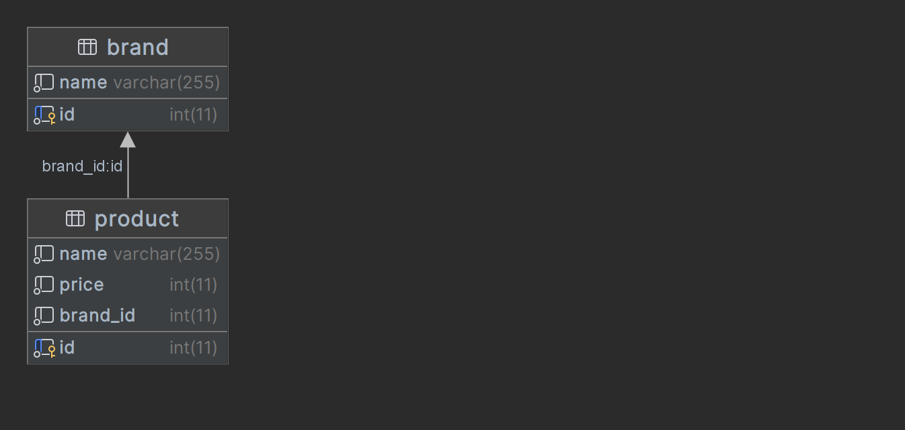

Zadání
===

Cílem je tento grafický návrh naprogramovat jako funkční aplikaci v PHP za pomoci Nette frameworku, databáze MySQL, SASS a knihovny Materialize (http://materializecss.com).
Samozřejmě je možné, že některé z technologií nebudete přímo znát. Pro nás je hlavně důležité, jestli jste schopen se případně o dané technologii něco doučit a pokusit se použít.
Požadované funkce (implementovat vlastním kódem, bez použití volně šiřitelných gridů apod.):

1. Vylistování všech značek
   a. Řazení pomocí názvu značky (vzestupně, sestupně)
   b. Stránkování (včetně změny počtu položek na stránku)
   c. Editace značky – jednoduchý popup (není součástí návrhu, nechám na Vás)
   d. Smazání značky
2. Přidání nové značky – jednoduchý popup (není součástí návrhu, nechám na Vás)
   Očekávané výstupy:
1. Návrh databáze – v čitelné podobě (ideálně ER diagram) – png, pdf
2. SQL pro vytvoření a iniciální naplnění databáze
3. Zdrojové kódy aplikace + composer.json soubor popisující závislosti aplikace
4. CSS knihovna frameworku Materialize CSS, připojená do aplikace
5. SASS soubor s vlastními styly (přizpůsobení prvků knihovny Materialize)
6. Přeložený SASS soubor ve formě CSS, připojený do aplikace
   
Ve Vašem případě, protože se ucházíte o post team leadera, nebudeme brát příliš zřetel na body 4.-6., ale i tak by mělo výsledné řešení nějak vypadat 😊.

Záleží na Vašem volném čase, který je nutný k vypracování úkolu věnovat. Spíše se věnujte čistotě kódu, jeho bezpečnosti a udržitelnosti, které jsou pro nás důležitějším kritériem nežli čas. :) Klademe důraz na bezpečnost a čistotu kódu jako když jde do produkce resp. neměl by padat v chybách. Vnímáme i ošetření krajních stavů...


Spuštění
===

1. Docker build

```docker build```

2. Docker compose

```docker compose up -d```

3. Composer install

```docker exec -it php-app /bin/bash```

```cd nette```

```composer install```

Db model
===



Skript pro inicializaci DB včetně dat: [database.sql](database.sql)


